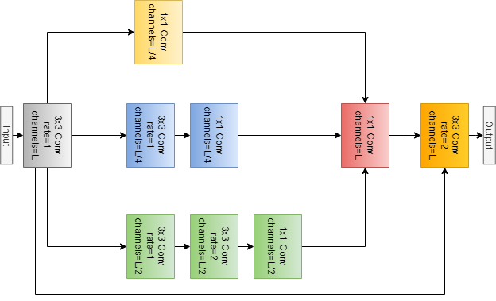
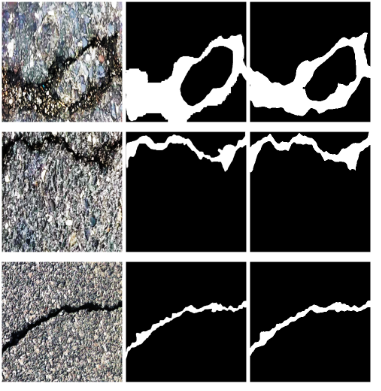

# Multi Scale Attention Based Efficient U-Net for Crack Segmentation

## Abstract
Crack detection, classification, and characterization are key
components of automatic structural health monitoring systems. Convolution
based encoder-decoder deep learning architecture have played a
significant role in developing crack segmentation models possessing limitations
in capturing the global context of the image. To overcome the
stated limitation, in the present study we propose a novel Multi-Scale Attention
based Efficient U-Net which effectively tries to solve this limitation. The
proposed method achieved an F1 Score of 0.775, an IoU of 0.663 and
an accuracy of 97.3% on Crack500 dataset improving upon the current
state-of-the-art models.

<hr>

## Train the model
```commandline
python train.py --path_imgs "path_to_image_folder" --path_masks "path_to_mask_folder" --out_path "out_path_to_store_best_model_and_logs"
```

<hr>

## Evaluate Model
```commandline
python evaluate.py --path_imgs "path_to_image_folder" --path_masks "path_to_mask_folder" --model_path "path_to_saved_model" --result_path "path_to_save_results_from_test" --plot_path "path_to_store_plots"
```
<hr>

## Model Architecture
<br>
<figure>

<figcaption align = "center"><b>Fig.1 - Main Architecture</b></figcaption>
</figure>
<br>
<br>
<figure>

<figcaption align = "center"><b>Fig.2 - Multi Scale Attention</b></figcaption>
</figure>
<hr>

## Dataset
Crack500 Dataset: This dataset includes 500 images of pavement cracks with
a resolution of 2000 x 1500 pixels collected at Temple University campus using a
smartphone by [1]. Each image is annotated on a pixel level. Images this large
won’t fit on GPU memory; therefore, [1] patched each image into 16 smaller
images. The final resolution of each image was 640x320, and the dataset has 1896
images in training set, 348 images in validation set, and 1124 images in testing
set. The comparisons with state-of-the-art models were made on the results from
the testing set

<hr>

## Results

<table>
    <th>Dataset</th>
    <th>Accuracy</th>
    <th>Precision</th>
    <th>Recall</th>
    <th>F1-Score</th>
    <th>IoU</th>
    <tr>
    <td>Crack500</td>
    <td>97.4</td>
    <td>0.763</td>
    <td>0.790</td>
    <td>0.775</td>
    <td>0.621</td>
    </tr>
</table>
<br>
<figure>
<figcaption><b>RGB Image</b>  &ensp;&ensp;&ensp;&ensp;  <b>Ground Truth</b>&ensp;&ensp;&ensp;&ensp;<b>Prediction (Model Output)</b></figcaption>


<figcaption align="center"><b>Fig 3: Result From model</b></figcaption>
</figure>
<hr>

## Resouces

- Colab Notebook link: <a href="https://colab.research.google.com/drive/1LLnRU-P2YrQrGzI6K5Yqn39x6s2pFL9H?usp=sharing">Colab Notebook</a>
- Best Model and Logs: <a href="https://drive.google.com/drive/folders/1qEe5Ox27RgM5KZum3dNJmUEUzoXGj_as?usp=sharing">Best Model and Logs</a>

<hr>

## ToDo
- Dockerise code

## References
[1] F. Yang, L. Zhang, S. Yu, D. Prokhorov, X. Mei, and H. Ling, “Feature pyramid and
hierarchical boosting network for pavement crack detection,” IEEE Transactions
on Intelligent Transportation Systems, vol. 21, no. 4, pp. 1525–1535, 2020.

[2] Lyu, C., Hu, G. & Wang, D. Attention to fine-grained information: hierarchical multi-scale network for retinal vessel segmentation. Vis Comput 38, 345–355 (2022). https://doi.org/10.1007/s00371-020-02018-w
